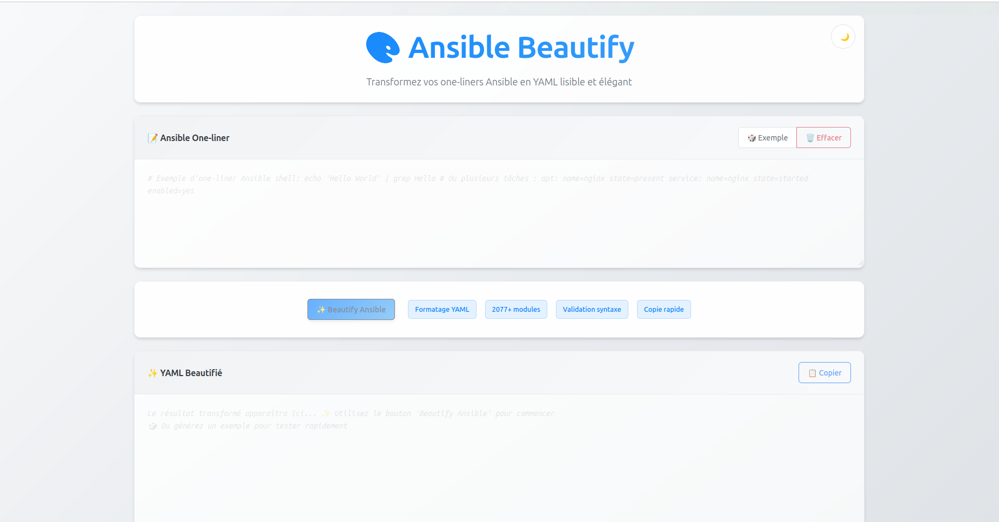

# 🎨 Ansible Beautify

<div align="center">

[](https://travis-ci.com/Courouge/ansible-beautify)
[](LICENSE)
[](docker-compose.yml)
[](react-api/package.json)
[](backend/requirements.txt)

**Transform your one-liner Ansible tasks into beautiful, readable YAML format**

[🚀 Live Demo](#demo) • [📖 Documentation](#usage) • [🐳 Quick Start](#quick-start) • [🤝 Contributing](#contributing)

</div>

---

## ✨ What is Ansible Beautify?

Ansible Beautify is a web-based tool that transforms condensed, hard-to-read Ansible task syntax into clean, properly formatted YAML. Perfect for:

- 📚 **Learning Ansible**: Understand task structure better
- 🔧 **Code Review**: Make tasks more readable for your team
- 📝 **Documentation**: Generate clean examples for documentation
- 🎯 **Best Practices**: Follow Ansible YAML formatting standards

## 🖥️ Interface Preview

<div align="center">



*Clean and intuitive web interface for transforming Ansible one-liners*

</div>

## 🔄 Transformation Example

### Before (Hard to read) 😵
```yaml
- name: Insert trololo
  lineinfile: dest=/etc/trololo state=present regexp="{{ trololo }}" insertafter="trololo" line="trololo"
  notify: restart trololo
```

### After (Beautiful & Clear) ✨
```yaml
- name: Insert trololo
  lineinfile:
    dest: /etc/trololo
    regexp: "{{ trololo }}"
    insertafter: trololo
    line: trololo
    state: present
  notify: restart trololo
```

## 🚀 Quick Start

### Using Docker (Recommended)

1. **Clone the repository**
   ```bash
   git clone https://github.com/Courouge/ansible-beautify.git
   cd ansible-beautify
   ```

2. **Start the application**
   ```bash
   docker-compose up -d --force-recreate --build
   ```

3. **Open your browser**
   ```
   http://localhost:3000
   ```

That's it! 🎉

### Manual Installation

<details>
<summary>Click to expand manual installation steps</summary>

#### Backend Setup
```bash
cd backend
pip install -r requirements.txt
python api.py
```

#### Frontend Setup
```bash
cd react-api
npm install
npm start
```

</details>

## 💡 Usage

1. **Input**: Paste your one-liner Ansible tasks in the left panel
2. **Process**: Click the "Process" button
3. **Output**: Get beautifully formatted YAML in the right panel
4. **Copy**: Use the formatted code in your playbooks

## 🌟 Features

- ✅ **All Ansible Modules Supported**: Works with any Ansible module
- ✅ **Custom Modules**: Add your own modules via `modules.txt`
- ✅ **Real-time Processing**: Instant transformation
- ✅ **Docker Ready**: One-command deployment
- ✅ **Responsive Design**: Works on desktop and mobile
- ✅ **Syntax Validation**: Detects and reports syntax errors

## 🛠️ Technology Stack

- **Frontend**: React 16.9, Bootstrap 4, Axios
- **Backend**: Python Flask, Ansible Parser
- **Infrastructure**: Docker, Docker Compose
- **CI/CD**: Travis CI

## 📁 Project Structure

```
ansible-beautify/
├── 🐳 docker-compose.yml    # Docker orchestration
├── 📱 react-api/           # React frontend
│   ├── src/
│   ├── public/
│   └── package.json
├── 🐍 backend/             # Python Flask API
│   ├── api.py
│   ├── modules.txt         # Supported Ansible modules
│   └── requirements.txt
└── 📚 docs/               # Documentation
```

## 🤝 Contributing

We love contributions! Here's how you can help:

1. 🍴 **Fork** the repository
2. 🌿 **Create** a feature branch (`git checkout -b feature/amazing-feature`)
3. 💾 **Commit** your changes (`git commit -m 'Add amazing feature'`)
4. 📤 **Push** to the branch (`git push origin feature/amazing-feature`)
5. 🔄 **Open** a Pull Request

### Adding New Modules

To add support for custom Ansible modules:
1. Add module names to `backend/modules.txt`
2. One module per line
3. Submit a PR with your additions

## 📊 Roadmap

- [ ] 🎨 Modern UI/UX redesign
- [ ] 🌙 Dark mode support
- [ ] 💾 Save/Load functionality
- [ ] 📥 Batch processing
- [ ] 🔗 API endpoints
- [ ] 🧪 Unit tests
- [ ] 📱 Mobile app

## 📄 License

This project is licensed under the MIT License - see the [LICENSE](LICENSE) file for details.

## 🙏 Acknowledgments

- Built with ❤️ for the Ansible community
- Inspired by the need for readable automation code
- Thanks to all contributors and users

---

<div align="center">

**[⭐ Star this repository](https://github.com/Courouge/ansible-beautify) if you find it useful!**

Made with ❤️ by [Florian Courouge](https://fr.linkedin.com/in/floriancourouge)

</div>
